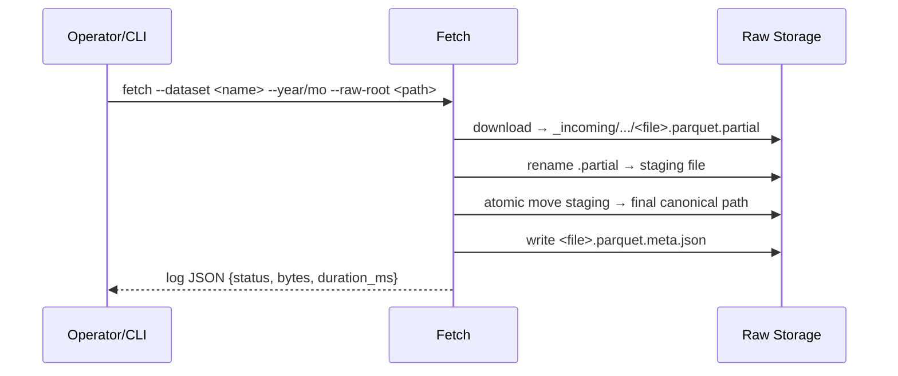

# Architecture

I separate data transport (Fetch) from observation and registration (Ingestion). This gives me small, testable components with clear failure domains and durable, auditable outcomes.

## High‑Level View

```mermaid
flowchart TD
  CLI[CLI: dgap.main] -->|fetch| Fetch[Fetch (Sprint 2)]
  CLI -->|ingest| Ingest[Ingestion (Sprint 1)]
  Fetch -->|download → stage → atomic move| Raw[Raw Storage (canonical layout)]
  Fetch -->|write| Sidecar[(Sidecar .meta.json)]
  Ingest -->|read| Raw
  Ingest -->|best‑effort| Sidecar
  Ingest -->|write| SQLite[(SQLite Ledger)]
```

- Fetch: Transport‑only layer that stages downloads and commits atomically so partial files never land in final locations.
- Ingestion: Streaming checksum and idempotency layer that records provenance in SQLite.

## Component Responsibilities
- `dgap.main`: CLI entry, argument parsing, and command dispatch (fetch/ingest).
- `dgap.fetch_raw`: downloads into `raw_root/_incoming/.../*.partial`, renames to staging, atomically moves to final canonical paths; writes sidecars and JSON logs.
- `dgap.ingest_raw`: discovers files under `raw_root`, validates guardrails, computes SHA‑256 checksums (1MB chunks), reads sidecars best‑effort, writes the ledger.
- `dgap.idempotency`: streaming checksum utilities, consistent run IDs, timestamp helpers.
- `dgap.metadata`: SQLite schema, PRAGMAs, CRUD for `ingestion_runs` and `file_registry`.

## Data Flow (Fetch)



## Data Flow (Ingestion)

```mermaid
flowchart LR
  D[Discover files under raw_root] --> G{Guardrails OK?}
  G -- no --> Skip[Skip/log]
  G -- yes --> H[Stream SHA‑256]
  H --> I{Exists in registry with same checksum?}
  I -- yes --> S[Skip (idempotent)]
  I -- no --> C{Exists with different checksum?}
  C -- yes --> Fail[Collision → fail run]
  C -- no --> W[Write file_registry]
  W --> R[Update ingestion_runs]
```

## Canonical Layout

```text
raw_root/
  source=tlc/
    dataset=<dataset>/
      year=YYYY/
        month=MM/
          <dataset>_YYYY-MM.parquet
          <dataset>_YYYY-MM.parquet.meta.json
```

See also: [ADR‑002](adr/002-fetch-ingest-separation.md), [ADR‑003](adr/003-canonical-raw-layout.md), [ADR‑004](adr/004-staging-atomic-commit.md), [ADR‑005](adr/005-sidecar-provenance.md).
