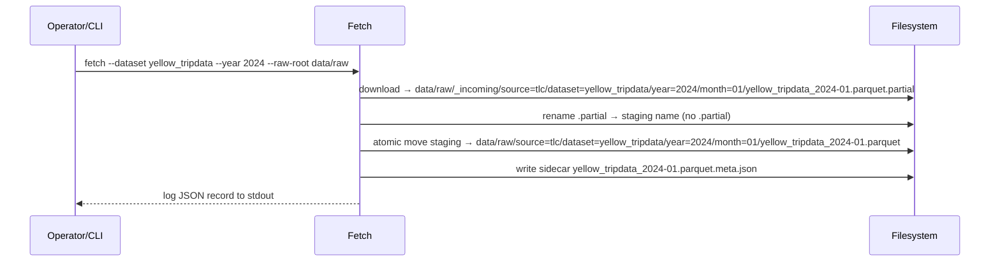

# Fetch Guide (Sprint 2)

This guide describes transport‑only fetching into the canonical raw layout with staging and atomic commit, plus sidecar creation and logging.

## Scope and Guarantees
- Transport only: I don’t hash here and I don’t write SQLite.
- Atomic commit: I only create final paths when the download is complete and validated.
- Provenance: The system writes sidecars with `source_uri` and fetch metadata; ingestion reads these best‑effort.
- Idempotent integration: ingestion remains the single source of truth for the ledger.

## URL Pattern (NYC TLC)
```
https://d37ci6vzurychx.cloudfront.net/trip-data/{dataset}_{year}-{month:02d}.parquet
```
Example: `yellow_tripdata_2024-01.parquet`.

## Canonical Target Layout
```
raw_root/source=tlc/dataset=<dataset>/year=YYYY/month=MM/<dataset>_YYYY-MM.parquet
```

## Staging and Atomic Move



- Partial files never appear in final locations.
- If the final file already exists, the system deletes staging and logs `status=skipped, reason=already_exists`.

## Sidecar Schema
A `.meta.json` file accompanies each parquet in the same directory:
```json
{
  "source_uri": "https://.../yellow_tripdata_2024-01.parquet",
  "dataset": "yellow_tripdata",
  "year": 2024,
  "month": 1,
  "fetched_at_utc": "2026-01-13T12:00:00Z",
  "bytes": 12345678
}
```
Ingestion treats this as best‑effort provenance; failures to read do not affect idempotency.

## CLI Usage
```powershell
# Single month
python -m dgap.main fetch --dataset yellow_tripdata --year 2024 --month 1 --raw-root data/raw

# Entire year
python -m dgap.main fetch --dataset yellow_tripdata --year 2024 --raw-root data/raw

# Range (YYYY-MM)
python -m dgap.main fetch --dataset yellow_tripdata --from 2024-01 --to 2024-03 --raw-root data/raw
```

## Logging

I emit one JSON record per file attempt to stdout. Example:
```json
{
  "timestamp": "2026-01-13T16:30:00Z",
  "level": "INFO",
  "action": "fetch",
  "dataset": "yellow_tripdata",
  "year": 2024,
  "month": 1,
  "source_uri": "https://d37ci6vzurychx.cloudfront.net/trip-data/yellow_tripdata_2024-01.parquet",
  "target_path": "data/raw/source=tlc/dataset=yellow_tripdata/year=2024/month=01/yellow_tripdata_2024-01.parquet",
  "raw_root": "data/raw",
  "bytes": 12345678,
  "duration_ms": 4500,
  "status": "success"
}
```

**Fields:**
- `status`: `success|skipped|error`
- `reason`: additional context when `status != success`
- All other fields present on every record

## Integration with Ingestion
- Fetch doesn’t compute checksums or write to SQLite.
- Ingestion reads the sidecar (if present) and writes `source_uri` to `file_registry`.
- Ingestion idempotency/collision rules remain authoritative.
