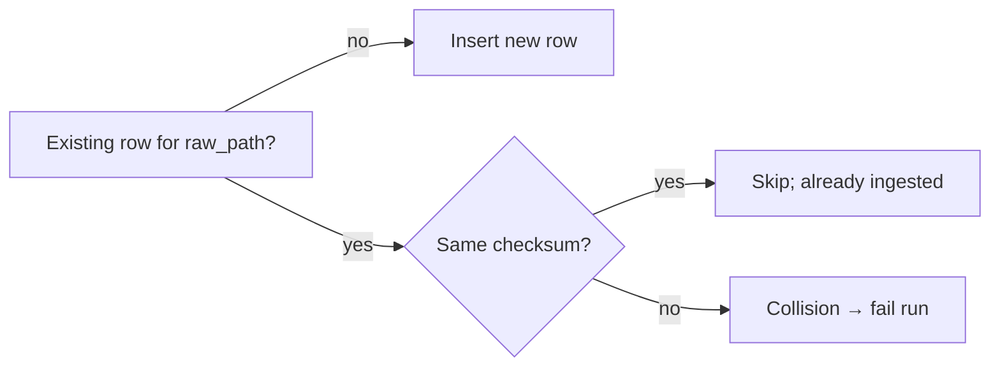

# Ingestion Guide (Sprint 1)

Here’s how I perform discovery, guardrails, streaming checksums, idempotency/collision handling, and ledger writes.

## Goals
- Immutable ingestion: I never mutate raw files.
- Idempotent results: re‑runs don’t duplicate entries.
- Auditable ledger: I record all runs with UTC timestamps.

## Flow

```mermaid
flowchart TD
  Start([Start]) --> Discover[Discover files under raw_root]
  Discover --> Guard{Guardrails OK?\nexists, regular, non-zero}
  Guard -- no --> Skip[Skip & log]
  Guard -- yes --> Hash[Stream SHA‑256 (1MB chunks)]
  Hash --> Lookup{raw_path in registry?}
  Lookup -- yes --> Same{checksum unchanged?}
  Same -- yes --> Idem[Skip (idempotent)] --> End
  Same -- no --> Collision[COLLISION → fail run]
  Lookup -- no --> Insert[Insert into file_registry]
  Insert --> Update[Update ingestion_runs]
  Update --> End([End])
```

## Key Definitions
- `raw_path`: POSIX‑style relative path under the configured `raw_root`.
- `checksum_sha256`: streaming hash of file content (1MB chunks).
- `bytes_hashed` equals file size; I enforce `CHECK(bytes_hashed = file_size_bytes)`.

## Idempotency and Collisions



- Same `raw_path` + same checksum → idempotent skip.
- Same `raw_path` + different checksum → collision (signals corruption or overwrite).

## Sidecar Handling (Best‑Effort)
- If `<file>.parquet.meta.json` exists, I read it and store `source_uri` in `file_registry.source_uri`.
- Missing or malformed sidecars don’t affect idempotency and never cause ingestion to fail.

## CLI Examples
```powershell
# Dry-run: compute checksums without writing SQLite
python -m dgap.main ingest --raw-root data/raw --db-path data/ledger.db --dry-run

# Normal run
python -m dgap.main ingest --raw-root data/raw --db-path data/ledger.db
```

See also: [sprint_1_validation.md](sprint_1_validation.md) and ADRs [002](adr/002-fetch-ingest-separation.md), [003](adr/003-canonical-raw-layout.md), [005](adr/005-sidecar-provenance.md).
