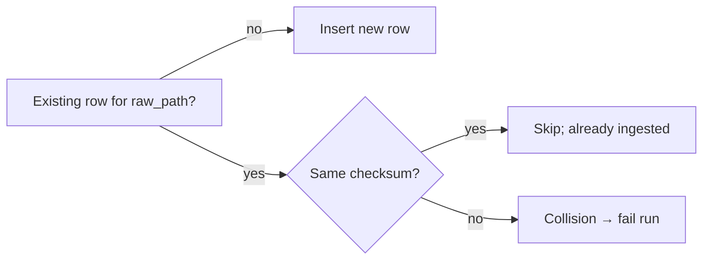

# Ingestion Guide (Sprint 1)

This guide describes discovery, guardrails, streaming checksums, idempotency/collision handling, and ledger writes.

## Goals
- Immutable ingestion: Raw files are never mutated.
- Idempotent results: re‑runs don’t duplicate entries.
- Auditable ledger: I record all runs with UTC timestamps.

## Flow

```mermaid
flowchart TD
  Start([Start]) --> Discover[Discover files under raw_root]
  Discover --> Guard{Guardrails OK?\nexists, regular, non-zero}
  Guard -- no --> Skip[Skip & log]
  Guard -- yes --> Hash[Stream SHA‑256 (1MB chunks)]
  Hash --> Lookup{raw_path in registry?}
  Lookup -- yes --> Same{checksum unchanged?}
  Same -- yes --> Idem[Skip (idempotent)] --> End
  Same -- no --> Collision[COLLISION → fail run]
  Lookup -- no --> Insert[Insert into file_registry]
  Insert --> Update[Update ingestion_runs]
  Update --> End([End])
```

## Key Definitions
- `raw_path`: POSIX‑style relative path under the configured `raw_root`.
- `checksum_sha256`: streaming hash of file content (1MB chunks).
- `bytes_hashed` equals file size; enforced via `CHECK(bytes_hashed = file_size_bytes)`.

## Idempotency and Collisions



- Same `raw_path` + same checksum → idempotent skip.
- Same `raw_path` + different checksum → collision (signals corruption or overwrite).

## Sidecar Handling (Best‑Effort)
- If `<file>.parquet.meta.json` exists, the system reads it and stores `source_uri` in `file_registry.source_uri`.
- Missing or malformed sidecars don’t affect idempotency and never cause ingestion to fail.

## SQLite Schema & PRAGMAs

The system enforces these settings for durability and performance:
```sql
PRAGMA journal_mode = WAL;  -- Write-ahead logging for better concurrency
PRAGMA synchronous = NORMAL;  -- Balance durability vs performance  
PRAGMA foreign_keys = ON;  -- Enforce referential integrity
```

**Tables:**
```sql
CREATE TABLE ingestion_runs (
    run_id TEXT PRIMARY KEY,
    started_at_utc TEXT NOT NULL,
    finished_at_utc TEXT,
    status TEXT NOT NULL,
    files_seen INTEGER DEFAULT 0,
    files_ingested INTEGER DEFAULT 0,
    errors TEXT
);

CREATE TABLE file_registry (
    raw_path TEXT PRIMARY KEY,
    checksum_sha256 TEXT NOT NULL,
    file_size_bytes INTEGER NOT NULL,
    bytes_hashed INTEGER NOT NULL,
    checksum_duration_ms INTEGER NOT NULL,
    source_uri TEXT,
    first_seen_run_id TEXT NOT NULL,
    ingested_at_utc TEXT NOT NULL,
    CONSTRAINT bytes_match CHECK (bytes_hashed = file_size_bytes),
    FOREIGN KEY (first_seen_run_id) REFERENCES ingestion_runs(run_id)
);
```

## CLI Examples
```powershell
# Dry‑run: compute checksums without writing SQLite
python -m dgap.main ingest --raw-root data/raw --db-path data/ledger.db --dry-run

# Normal run
python -m dgap.main ingest --raw-root data/raw --db-path data/ledger.db
```

See also: [sprint_1_validation.md](sprint_1_validation.md) and ADRs [002](adr/002-fetch-ingest-separation.md), [003](adr/003-canonical-raw-layout.md), [005](adr/005-sidecar-provenance.md).
